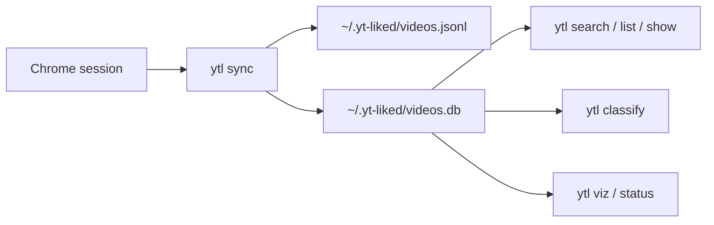

# yt-liked

`yt-liked` gives you `ytl`: a macOS-first CLI for syncing your YouTube liked videos from Chrome, then searching, classifying, and inspecting them locally.

Local-first. No telemetry. No hosted sync service. No hosted classification service.

## How It Works



## Install

```bash
npm install -g yt-liked@alpha
```

Requires Node.js 20+ and Google Chrome.

## Quick Start

```bash
# 1. Sync from your logged-in Chrome YouTube session
ytl sync

# 2. Classify what was synced
ytl classify

# 3. Explore it
ytl search "machine learning"
ytl viz
ytl status
```

On first run, `ytl sync` reads your YouTube session from Chrome and writes local data under `~/.yt-liked/`.

If YouTube stops exposing more history on your account, `ytl` writes an honest sync proof report instead of claiming a full backfill it could not reach.

## Commands

| Command | What it does |
| --- | --- |
| `ytl sync` | Sync liked videos from your logged-in Chrome session |
| `ytl sync --full` | Keep crawling instead of stopping after repeated known pages |
| `ytl search <query>` | Full-text search over your local archive |
| `ytl list` | Filter and browse local results |
| `ytl show <video-id-or-url>` | Show one video in detail |
| `ytl viz` | Terminal dashboard with archive summary |
| `ytl stats` | Same dashboard shortcut |
| `ytl status` | Show sync and classification status |
| `ytl path` | Print local data paths |
| `ytl classify` | Classify by category and domain |
| `ytl classify-domains` | Run domain-only classification |
| `ytl enrich-channels` | Repair uploader metadata |
| `ytl import <path>` | Load an existing export as a fallback |

## Classification

`ytl classify` and `ytl classify-domains` support:

- `gemini`
- `claude`
- `codex`

If you omit `--engine` in an interactive terminal, `ytl` opens an engine picker.

Gemini is the default guided path:

- default model: `models/gemini-3.1-flash-lite-preview`
- default batch size: `50`
- default concurrency: `10`

If no Gemini key is configured, `ytl` opens a hidden paste-to-save prompt and writes it to `~/.yt-liked/.env.local`.

Examples:

```bash
ytl classify --engine gemini
ytl classify --engine claude
ytl classify-domains --engine codex
```

| Engine | Auth | Best for |
| --- | --- | --- |
| `gemini` | `GEMINI_API_KEY` or `GOOGLE_API_KEY` | fastest and cheapest default path |
| `claude` | local `claude` CLI login | FT-style local CLI workflow |
| `codex` | local `codex` CLI login | same local CLI model |

## Fallback Import

If native sync stalls on your account, you can still load an existing export:

```bash
ytl import /path/to/liked_videos.json
ytl enrich-channels
ytl classify
```

## Local Files

```text
~/.yt-liked/
  videos.jsonl               raw synced records
  videos.db                  SQLite FTS index
  videos-meta.json           sync metadata
  videos-backfill-state.json sync proof report
  .env.local                 local Gemini config
```

## Current Limits

- strict YouTube-web-only full-history sync can still plateau before the playlist header count
- when that happens, `ytl sync` exits honestly and writes a machine-readable report
- some imported archives collapse uploader metadata to the playlist owner; `ytl enrich-channels` repairs that

## Security

Your data stays local. `ytl` only makes network requests to YouTube during sync, enrichment, and optional classification.

Chrome-session sync reads cookies from Chrome's local database and uses them for sync requests. Classification uses your own Gemini API key or your existing Claude/Codex CLI login.

## Acknowledgements

`yt-liked` was heavily inspired by [Field Theory CLI](https://github.com/afar1/fieldtheory-cli) by [afar1](https://github.com/afar1), especially its local-first CLI shape, terminal UX, and "browser session -> local archive -> search/classify" product framing.

## Development

```bash
npm install
npm run build
npm test
```
